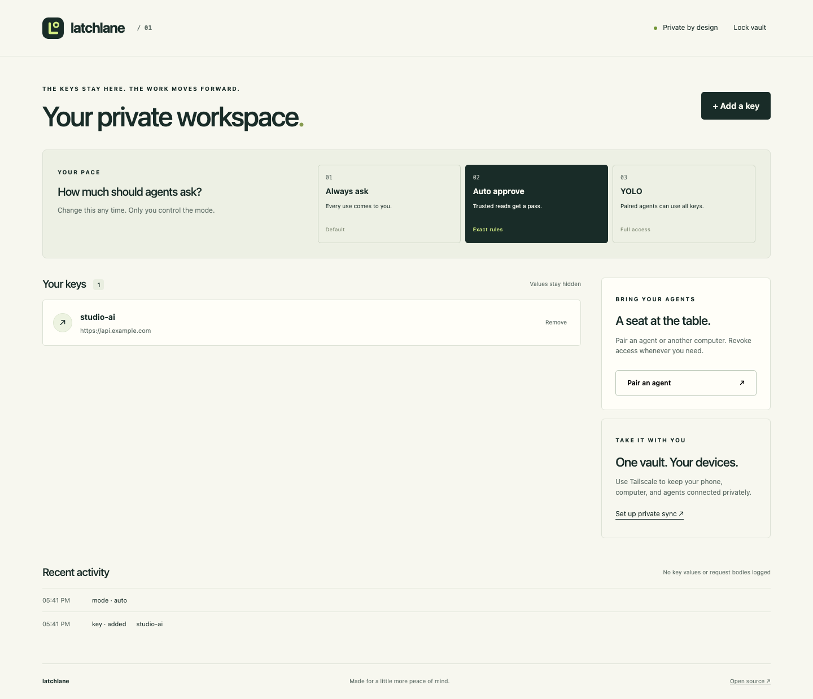

<p align="center">
  
</p>

<p align="center">
  An encrypted API-key vault that asks before your agent acts.
  <br>
  Capture a key locally. Pair your agent. Decide what it can do.
</p>

<p align="center">
  <a href="https://github.com/baney75/latchlane/actions/workflows/test.yml"></a>
  <a href="https://github.com/baney75/latchlane/releases"></a>
  <a href="LICENSE"></a>
</p>

<p align="center">
  <a href="#get-started">Get started</a> ·
  <a href="docs/getting-started.md">Guide</a> ·
  <a href="SECURITY.md">Security</a> ·
  <a href="https://github.com/baney75/latchlane/issues">Help & feedback</a>
</p>

## A key should not become a chat message

Latchlane keeps API keys in a vault on a computer you control. Agents request an operation through its CLI or MCP server; the broker attaches the credential and calls the provider. You see who is asking, what they want to do, and why.

The owner console handles clipboard capture, approvals, and revocation. Optional Tailscale access connects your other devices to the same vault. No hosted Latchlane account, telemetry, or macOS Keychain dependency.

## Get started

Give your agent this prompt:

```text
Set up Latchlane using https://github.com/baney75/latchlane
and its skills/latchlane/SKILL.md. Install the CLI and skill,
then guide me through creating a vault and pairing my agent.
Keep Always ask on unless I choose otherwise. I will enter
passphrases and keys locally, never in chat. Ask whether I
want to connect my other devices through Tailscale.
```

Or start it yourself with [uv](https://docs.astral.sh/uv/getting-started/installation/) and Python 3.11+:

```sh
uv tool install 'git+https://github.com/baney75/latchlane@v0.1.1'
latchlane start
```

Your browser opens the vault setup. Create a passphrase, choose **Add a key**, name it, and choose **Watch next copy**. Copy your key and return to the window; Latchlane encrypts it when the form is complete. Browsers that block clipboard watching offer a masked paste field. [Continue to agent pairing →](docs/getting-started.md#pair-an-agent)

## You choose how often agents ask

| Mode | Agent access |
| :--- | :--- |
| **Always ask** · installed default | You approve each use. Approval expires after five minutes and works once. |
| **Auto approve** | Only exact GET routes you previously trusted run without a prompt. Everything else requires approval. |
| **YOLO** | Paired agents can use every key without asking, including raw-key access. |

Agents cannot change the mode or approve themselves. The broker enforces the policy; a prompt is not the security boundary.



## Use it from your tools

After [pairing](docs/getting-started.md#pair-an-agent), an agent can list key names and make a request:

```sh
latchlane keys
latchlane request my-service /v1/models --purpose 'List available models'
```

The [MCP integration](docs/getting-started.md#mcp) exposes the same brokered workflow. For a trusted SDK that needs an environment variable, [`latchlane run`](docs/getting-started.md#pair-an-agent) can release a key directly to one child process. That process can read or retain it.

## One vault, across your devices

Run `latchlane connect` for guided Tailscale installation, browser sign-in, and private HTTPS. Use the console from a phone or pair an agent on another computer. This connects to **one online vault host**; it does not make offline copies of your secrets.

The host and CLI support macOS, Windows, and Linux. Phones and tablets use the browser console with an explicit paste fallback. [Device setup and requirements →](docs/devices.md)

## Know what protects your keys

Vault contents use AES-256-GCM with a passphrase-derived scrypt key. The passphrase is not saved by default. Agent pairing is revocable, and broker requests stay within the provider origin you configured.

A process with access to the host’s memory or owner session can bypass broker permissions. Keep untrusted agents on a separate host or OS account. Clipboard history may retain copied secrets. Optional unattended unlocking trades passphrase protection for host access controls.

This is an early release, with cross-platform CI and adversarial regression tests, **not an independently audited secrets manager**. Read the [security boundaries](SECURITY.md) before storing production credentials.

---

[Architecture](docs/architecture.md) · [Test evidence](docs/release-checks.md) · [Contributing](CONTRIBUTING.md) · [MIT license](LICENSE)
