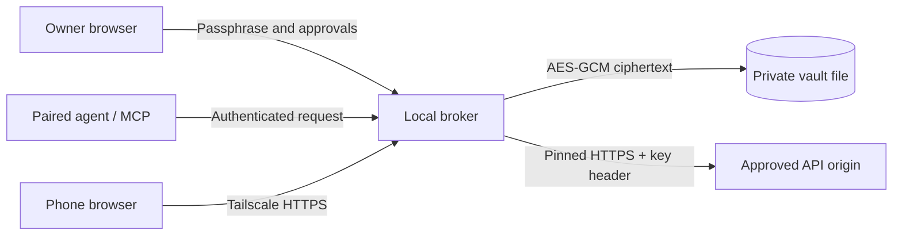

# A small, inspectable boundary

The Python host provides one owner console and a separate agent API. All devices
use the live host, so policies and credentials do not diverge between replicas.
Tailscale provides the transport. Application pairing remains a second boundary.

The host holds the derived vault key only while unlocked, unless the operator
explicitly enables a local unattended unlock file. The encrypted payload includes
key values, origins, trusted routes, policy, client-token hashes, and bounded audit
metadata. Each mutation writes a fresh authenticated ciphertext atomically. A file
lock prevents two CLI host processes from managing the same profile concurrently.

Owner sessions use HttpOnly, same-site cookies. Agent credentials use Authorization
headers. There is no owner-token fallback in the agent API, no risk override field,
and no dynamic agent-controlled proxy header. Request approval happens before one
immutable operation is consumed. Provider I/O occurs after consumption; uncertain
writes cannot be automatically replayed.

The default client path is brokered HTTPS. A raw-key lease exists for SDKs and child
processes, but is explicitly a release of control and always asks in Auto approve.
The MCP interface only offers the broker path. Read SECURITY.md before deploying
on the same machine/account as an untrusted agent.

The browser is vanilla HTML, CSS and JavaScript served from the local package. It
loads no CDN code, analytics or fonts. Clipboard capture happens in the user's
browser. Python handles encryption; Tailscale's own client handles sign-in.
